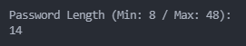
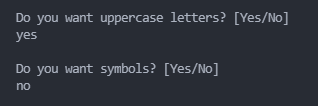

# Random Password Generator

This program was developted by **Wellington Sampaio**.

Email: wellbscontato@gmail.com

## Usage

---

This code should be used in terminal.

`python main.py`

Later on a download setup will be implemented.

## Features

---

### Length

In this program you can choose the length of the password ranging from 8 to 48 characteres.

### Others Characters

Lowercase characteres and digits are used by default, but you can implement symbols and uppercase characteres to your password if you want.

